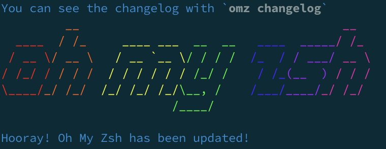

# **My Coding Path**

## :pushpin:01Feb.2023- Hello Github :tada:
Today is my first time to push the file successfully to Github.

After several hours for researching.

Created ssh-key, checked the environment, saw __OhMyZsh__ been updated with pic

which inspires me to __keep going__. :smile:

I edit code in Atom, type command line in terminal, learn how to use MARKDOWN to edit README.

Finally, I know how to update file on Github through git config.

Thanks my mentor [@jerome1210](https://github.com/Jerome1210)

:notebook_with_decorative_cover: *I'll continuously update README to record down my learning...*
___

### Learning Note
### :pushpin: 22Feb.2023
**HTML**/**javaScript**/**CSS**
- combination in ProjectMoney: three files (HTML/JS/CSS) interact on web page

  [javascript file: "tableAct.js"](ProjectMoney/tableAct.js) two functions demo as below:

 a. function setTimeout()
<video src="https://user-images.githubusercontent.com/120363088/220559533-b65c6740-544e-4a0c-82b5-22c1b81993ac.mp4" controls="controls" style="max-width: 400px;">
</video>

 b. function sum()
<video src="https://user-images.githubusercontent.com/120363088/220559450-7fb516d7-cc0a-4abd-8e2f-605e92d33b82.mp4" controls="controls" style="max-width: 400px;">
</video>
- [CSS basic](https://www.codecademy.com/learn/learn-css)

### :pushpin: 21Feb.2023
**HTML**
- [HTML basic (HyperText Markup Language)](https://www.codecademy.com/resources/docs/html/attributes)
- [HTML element](https://www.codecademy.com/resources/docs/html/elements)

### :pushpin: 20Feb.2023
**Node**
- Node.js Upload Files
- [ProjectProfile: html/css opened success on localhost by node](ProjectProfile) (http://localhost:8080/home.html)
- Sending Email using Node.js

**Git**
- [Git concepts review](https://www.codecademy.com/resources/docs/git/add)

### :pushpin: 17Feb.2023
**Node**
- HTTP module
- [File system](Node/note.md)
- [URL module1](Node/demo_read_url.js) / [URL module2](Node/demo_querystring.js)
- [NPM - Node.js package mamager](Node/NPM)
- [Events](Node/eventEmitter.js)

### :pushpin: 16Feb.2023
**CSS**
- [design my web](html/style.css)

### :pushpin: 15Feb.2023
**Node**
- [Node.js Tutorial](https://www.w3schools.com/nodejs/default.asp)

**CSS**
- [design my web](html/style.css)

### :pushpin: 14Feb.2023
**LeetCode**
- 14.Longest Common Prefix

**HTML**
- [create my web](html/home.html)

### :pushpin: 13Feb.2023
**javaScript**

- Sets (practice in [exercism](https://exercism.org/tracks/javascript/exercises/ozans-playlist/solutions/rubywu0604))

### :pushpin: 10Feb.2023
**javaScript**
- [Regular Expression](https://youtu.be/sa-TUpSx1JA)(practice in [exercism](https://exercism.org/tracks/javascript/exercises/regular-chatbot/solutions/rubywu0604))
- Array Loops (practice in [exercism](https://exercism.org/tracks/javascript/exercises/elyses-looping-enchantments/solutions/rubywu060400))

### :pushpin: 09Feb.2023
**javaScript**
- Errors and Inheritance (practice in [exercism](https://exercism.org/tracks/javascript/exercises/factory-sensors/solutions/rubywu0604))
- [prototype chain](https://youtu.be/GhJTy5-X3kA)

**LeetCode**
- 136.Single Number

### :pushpin: 07.08Feb.2023
**javaScript**
- [Prototypes and Classes](exercism/PrototypesAndClasses.js)(practice in [exercism](https://exercism.org/tracks/javascript/exercises/windowing-system/solutions/rubywu0604))

**reading** *(JavaScript: The Definitive Guide, 7th Edition)*
- Chapter 1.Introduction to JavaScript
- Chapter 2.Lexical Structure

**LeetCode**
- 7.Reverse Integer

### :pushpin: 06Feb.2023
**javaScript**
- Array Transformations(practice in [exercism](https://exercism.org/tracks/javascript/exercises/elyses-transformative-enchantments/solutions/rubywu0604))

### :pushpin: 04Feb.2023
**javaScript**
- Tpye Conversion (practice in [exercism](https://exercism.org/tracks/javascript/concepts/type-conversion))
- Template Strings/Ternary Operator (practice in [exercism](https://exercism.org/tracks/javascript/exercises/custom-signs/solutions/rubywu0604))
- Array Destructuring/Rest and Spread (practice in [exercism](https://exercism.org/tracks/javascript/exercises/elyses-destructured-enchantments/solutions/rubywu0604))
- Array Analysis/Arrow Functions (practice in [exercism](https://exercism.org/tracks/javascript/exercises/elyses-analytic-enchantments/solutions/rubywu0604))

### :pushpin: 03Feb.2023
**javaScript**
- [Callback](exercism/callback.js) (practice in [exercism](https://exercism.org/tracks/javascript/concepts/callbacks))

**Git**
- [merge vs rebase](https://www.youtube.com/watch?v=7Mh259hfxJg)
- alias
- [gitNote](git/gitNote.md)

### :pushpin: 02Feb.2023
**javaScript**
- [Callback](exercism/callback.js) (practice in [exercism](https://exercism.org/tracks/javascript/concepts/callbacks))

**Git**
- [MARKDOWN](https://youtu.be/HUBNt18RFbo)
- branch
- push / pull
- fetch
- merge
- rebase / reset / amend
